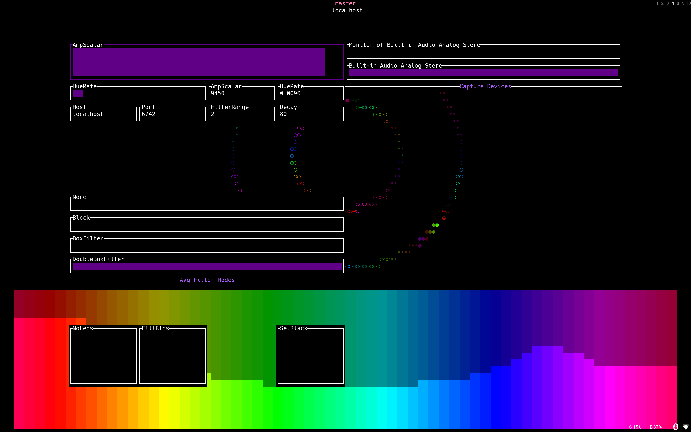

# VBZ - Audio visualizer OpenRGB Client



## Features
- Sync OpenRGB devices with audio frequency magnitude
- Frequency graph visualizer
- settings menu (acessed by the grave(`), f1 key

## Building

### Dependencies
- miniaudio

```
go bulid
```

- for nix a package output is available in the flake

## Cli Arguments
```
VBZ - OpenRGB Audio Visualizer Client
Usage: vbz [OPTION..]

[OPTIONS]
-d, --device-idx    Device to capture (use -l to see devices)
-c, --config        Config file path
--host              OpenRGB server host
--port              OpenRGB server port
--no-leds           Don't update leds
--no-open-rgb       Don't try to connect to OpenRGB server
--fill-bins         Fills side black bars in the bins visualizer
--hue-rate          Hue change rate (speeds up color wave)
--amp-scalar        scale up the amplitude for better visualization
--filter-mode       Averaging filter type
--filter-range      Range of the averaging filter
--decay             Percentage of decay of amplitude in each frame
```

## Credits
https://gitlab.com/CalcProgrammer1/KeyboardVisualizer
